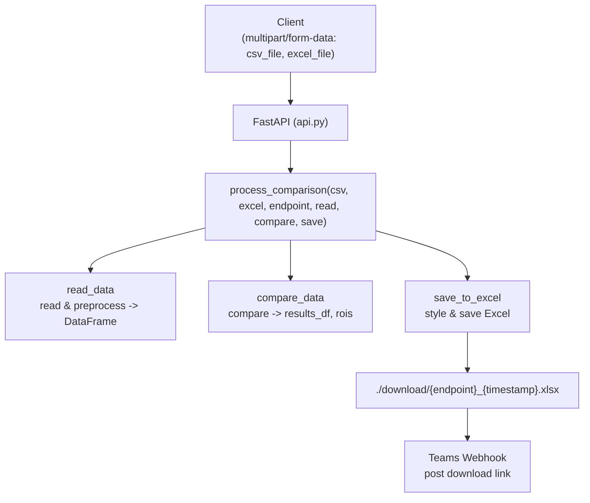

# Data-Validation-Tool

엔진 결과(CSV)와 정답지(Excel)를 비교하여 **스타일링된 결과 엑셀**을 생성하고, **다운로드 링크를 Microsoft Teams Webhook**으로 통지하는 FastAPI 기반 검증 도구입니다.  
각 모듈(AD, PET, CTP, AD20, MRA 등)은 **공통 실행기(`process_comparison`)** 패턴으로 손쉽게 확장할 수 있습니다.

---

## ✨ 핵심 기능

- CSV vs Excel 비교 후 결과 엑셀(`./download/{endpoint}_{timestamp}.xlsx`) 자동 생성
- **공통 실행기 패턴**: `process_comparison(csv, excel, endpoint, read_fn, compare_fn, save_fn)`
  - `read_data` — 파일 경로 → 전처리된 DataFrame 반환
  - `compare_data` — 비교 로직 실행 → `(results_df, rois)` 반환
  - `save_to_excel` — 결과/스타일 적용 → 지정 경로에 저장
- **Teams Webhook 알림**: ngrok 퍼블릭 URL 기반 다운로드 링크 자동 포함
- 모듈 추가가 쉬운 구조(폴더 단위 확장, 동일 시그니처 유지)

---

## 아키텍처 개요

### Mermaid 다이어그램



📁 디렉터리 구조(예시)
```
├─ AD/
│  ├─ T1/ (read_data.py, compare_data.py, save_to_excel.py)
│  ├─ T2/
│  ├─ Tau/
│  ├─ Amyloid/
│  ├─ Normative/
│  └─ ARIAE/
├─ AD20/
│  ├─ Tau/
│  └─ Flair/
├─ AQ/
├─ CTP/
│  ├─ read_data.py
│  ├─ compare_data.py
│  └─ save_to_excel.py
├─ MRA/
├─ PET/
│  ├─ DAT/
│  ├─ General/
│  ├─ Amyloid/
│  ├─ FDG/
│  └─ Tau/
├─ download/                # 결과 엑셀 저장 경로
├─ main.py                  # FastAPI 엔트리포인트/라우팅/공통 실행기
├─ api.py                   # (선택) API 분리 시 사용하는 파일
├─ requirements.txt
└─ start_ngrok.bat          # ngrok 실행 도우미(선택)
```
---
## 요구사항

- Python 3.9+
- 필수 패키지(예시): fastapi, uvicorn, pandas, openpyxl, requests, python-multipart
- 실제 의존성은 저장소의 requirements.txt를 우선 확인하세요.
---
## 설치 및 실행

```
# 1) 클론
git clone https://github.com/DoyeonKR/Data-Validation-Tool.git
cd Data-Validation-Tool

# 2) 가상환경 & 패키지 설치
python -m venv .venv
# Windows
. .venv/Scripts/activate
# macOS/Linux
source .venv/bin/activate

pip install -r requirements.txt

# 3) (선택) ngrok 실행
# ngrok http 9000   # 별도 터미널에서 실행, 4040 API가 떠 있어야 api.py에서 URL 감지

# 4) 서버 실행
uvicorn main:app --host 0.0.0.0 --port 9000 --reload

```

## API 사용법
### 공통
- HTTP Method: `POST`
- Content-Type: `multipart/form-data`
- 필드명: `csv_file`, `excel_file`
### 대표 엔드포인트 (예시)
- `/AD/T1/`, `/AD/T2/`, `/AD/Tau/`, `/AD/Amyloid/`
- `/AD/Normative/`, `/AD/ARIAE/`
- `/PET/DAT/`, `/PET/General/`, `/PET/Amyloid/`, `/PET/FDG/`, `/PET/Tau/`
- `/CTP/CT/`
- (유사 패턴으로 `/MRA/` 등 추가)

### cURL 예시
```
curl -X POST "http://127.0.0.1:9000/AD/T2/" \
  -F "csv_file=@SCALE_MRA_Results.csv" \
  -F "excel_file=@MRA_Answer.xlsx"
```
### 응답(JSON) 예시
```
{
  "message": "비교 완료. 결과 파일이 생성되었으며 다운로드 링크가 Teams로 전송되었습니다.",
  "download_link": "https://<ngrok-id>.ngrok.io/download/AD_T2_20250101_123456.xlsx"
}
```
- 결과 파일은 로컬 `./download/` 폴더에 저장됩니다.